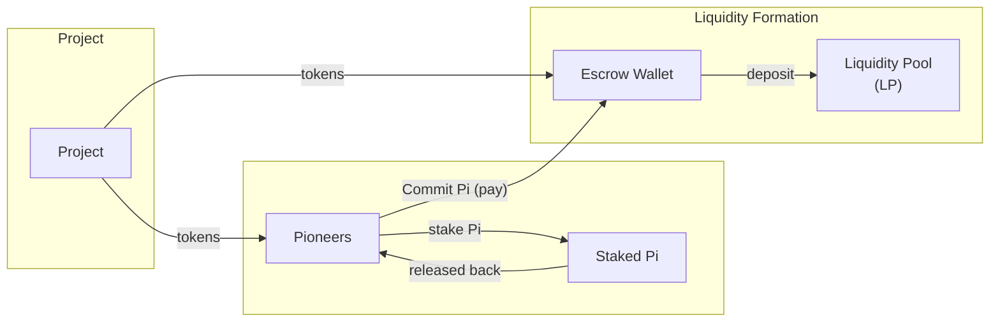

## 2. Core Design

### 2.1 Overview
Each launch follows these phases:

1. **Participation Window (Stake + Engagement)** — Users stake Pi to receive PiPower, which strictly determines the *maximum number of tokens* they can commit to buy in the launch. During this same window, users are invited to register and actively use the project's app. Engagement is measured (e.g., registration, onboarding, feature use, milestones). At window close, both staking and engagement are snapshotted to determine (a) each participant's PiPower that determines the caps of tokens they can buy and (b) an engagement-ranked order of participants, which can have an effect on their effective pricing.
2. **Allocation Period: Liquidity Formation & Distribution** — The Launchpad forms permanent liquidity and distributes tokens to participants using a defined allocation mechanism. The Launchpad can support multiple mechanisms. This is detailed in *Section 4 (Allocation)*. The community is invited to comment via the RFC on the available options. Early launches may use different mechanisms.
3. **Official TGE / Market Opening:**
   - When the Allocation Period ends, the LP/trading market opens for all. This event constitutes the official launch of the token (TGE).
4. **Post-launch period:**
   - Projects are required to have clear unlock schedules that are not more favorable than the community, and encouraged to commit to clear long-term token distributions and incentives for ongoing user engagement and acquisition.  

### 2.2 High-level token flows

* Pioneers commit to pay Pi in exchnage for receiving the new tokens. 
* All such Pi commitments are NOT transferred to the project, but to a liquidity pool, that will permanently support the new token.
* The project contributes additional tokens to the liquidity pool, alongside the Pi commitments, to form a robust pool.
* The project permanently disables its ability to withdraw this initial liquidity contribution; the pool remains fully accessible to users for Pi $\leftrightarrow$ token swaps or new liquidity deposits.

Next: [`3-Participation`](3-participation.md)