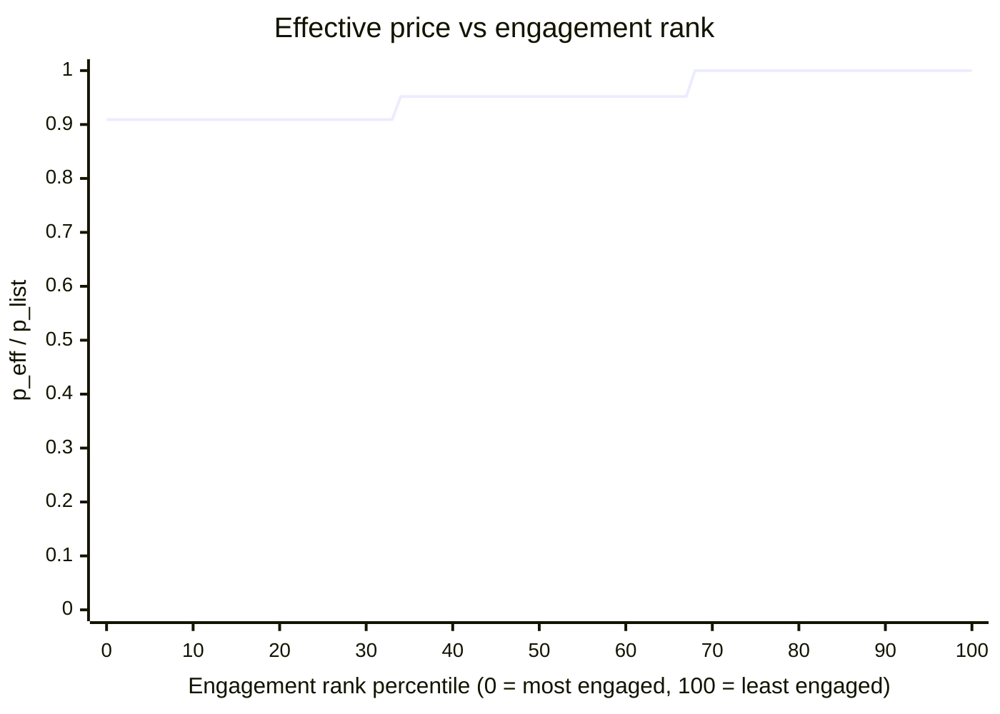

## 4 Allocation Period 

This section describes a **simple-model** allocation option, with discount based on engagement: all committed Pi goes into the LP, and each participant receives their token allocation once at a single clearing price. The project may add an engagement-based incentive so that the engaged participants with their product receive up to a discount about 10% on the purchasing price.

**Notation:**
- $C$ = total Pi committed by participants to purchase tokens of a project
- $T_{purchase}$ = tokens allocated to participants (purchase bucket)
- $T_{liquidity}$ = tokens reserved for liquidity seeding
- $T_{engage}$ = tokens allocated for engagement discounts
- $p_{list}$ = listing price (Pi per token) at which the LP is initialized

As initial parameters in this model, we set:

$$
T = T_{purchase} = T_{liquidity} 
$$

and

$$
T_{engage} = 5\%T
$$ 

So the total token amount supplied by the project to the Launchpad is:

$$
T_{purchase} + T_{liquidity} + T_{engage} = 2.05T
$$

This constitutes the token’s initial **circulating supply** at TGE (including tokens in the LP).

---

### 4.1 LP Formation and Allocation

The project provides three token buckets: $T_{purchase}$ (to participants), $T_{liquidity}$ (to LP), and $T_{engage}$ (for engagement). With $T_{purchase}=T_{liquidity}=T$, the **purchase** and **liquidity** buckets are equal-sized.

- **Participants** receive $T_{purchase}=T$ tokens in exchange for the total committed Pi $C$, at a single implied price:

$$
p = \frac{C}{T}
$$  

- The project deposits the entire committment C from all participants, along with the liquidity bucket, $T_{liquidity}$, which equals $T$, into the **Escrow Wallet**.
- The Escrow Wallet deposits the full $C$ Pi, together with $T$ tokens into the Liquidity Pool.
- The Liquidity Pool is therefore initialized with $(C,\, T)$, forming a listing price of:

$$
p_{list} = \frac{C}{T} = p
$$

So the LP is initialized at the same price as the price at which participants commit in the first place. Based on how much Pi each participant commits, they receive a portion of the $T_{purchase}=T$ tokens at the listing price $p_{list}=p$, if they do not receive any engagement discount.

Mathematically, participant $i$ with commitment $c_i$ receives their purchased tokens that is defined as **base tokens**:

$$
t_i^{base} = \frac{c_i}{p_{list}}
$$

---

#### Engagement-Based Discount

$T_{engage}=5\%T$ is used to provide a discount on the $p_{list}$ at the purchase based on participants' enagement with their product. Naturally, discounts only applies to someone who participates in the launch of the token and commits Pi (no free-riders). 

Discounts are distributed based on Engagement Score captured in Participation phase as follows:
- **Top 1/3** of participants (most engaged) receive **$\frac{2}{3}$** of $T_{engage}$
- **Middle 1/3** of participants receive **$\frac{1}{3}$** of $T_{engage}$
- **Bottom 1/3** receive no distribution from $T_{engage}$.

 

**Effective price for participant $i$:**
If $t_i^{discount}$ is the amount of tokens a participant $i$ gets due to their Engagement Score, then the *effective* bottom-line price ($p_{eff,i}$) they pay for the tokens is:

$$
p_{eff,i} = \frac{c_i}{t_i^{base} + t_i^{discount}}
$$

Index participants by Engagement Score rank $r_i \in \{1,2,\ldots,N\}$ where $r_i=1$ is most engaged.

Define the three rank tiers:
- $S_{top}$: the most engaged 1/3 of participants
- $S_{mid}$: the middle 1/3
- $S_{bottom}$: the remaining 1/3

Let total committed Pi within each tier be:

$$
C_{top} = \sum_{j \in S_{top}} c_j,\quad C_{mid} = \sum_{j \in S_{mid}} c_j
$$

Then the reward tokens for participant $i$ are:

$$
t_i^{engage}=
\begin{cases}
\frac{2}{3}T_{engage}\cdot \frac{c_i}{C_{top}}, & i \in S_{top}\\
\frac{1}{3}T_{engage}\cdot \frac{c_i}{C_{mid}}, & i \in S_{mid}\\
0, & i \in S_{bottom}
\end{cases}
$$

If commitments are uniformly distributed across all engagement tiers, then on average:
- Top tier receives about $10\%$ more tokens than base (since $\frac{2}{3}\cdot 5\% \div \frac{1}{3} = 10\%$).
- Middle tier receives about $5\%$ more tokens than base (since $\frac{1}{3}\cdot 5\% \div \frac{1}{3} = 5\%$).
- Bottom tier receives $0\%$ more tokens than base.

#### Diagram: effective price by engagement tier
All participants in the same tier have the same **effective price** (a step function by tier).

Let the tier token bonus be:

$$
b_i = \frac{t_i^{engage}}{t_i^{base}}
$$

Then:

$$
p_{eff,i}=\frac{c_i}{t_i^{base}(1+b_i)}=\frac{p}{1+b_i}
$$

and since $p_{list}=p$ in this uniform model:

$$
\frac{p_{eff,i}}{p_{list}}=\frac{1}{1+b_i}
$$

**Illustrative plot (assumes commitments are roughly uniform across tiers):**
- Top 1/3 bonus $b=10\%$ $\Rightarrow$ $p_{eff}/p_{list}\approx 0.909$
- Middle 1/3 bonus $b=5\%$ $\Rightarrow$ $p_{eff}/p_{list}\approx 0.952$
- Bottom 1/3 bonus $b=0\%$ $\Rightarrow$ $p_{eff}/p_{list}=1.0$

**Summary:**
- LP is formed exclusively with the "Deposit" operation without any use of the "Swap" operation; 
- All Pi committed, $C$, goes into the LP along with $T$ tokens.
- Participants collectively get $T + T_{engage}$ tokens. 
- The $T_{engage}=5\%T$ tokens are distributed by engagement rank in tiers: top 1/3 gets $\frac{2}{3}$ of $T_{engage}$, middle 1/3 gets $\frac{1}{3}$, bottom 1/3 gets none.
- Starting LP spot price is $p_{list} = \frac{C}{T}$
- Highly engaged participants pay $0.909p_{list}$. Medimum engaged participants pay $0.952p_{list}$. Least engaged participants pay $p_{list}$

Next: [`5-tge-state`](<../5-tge-state/5-tge-state design 1.md>)
