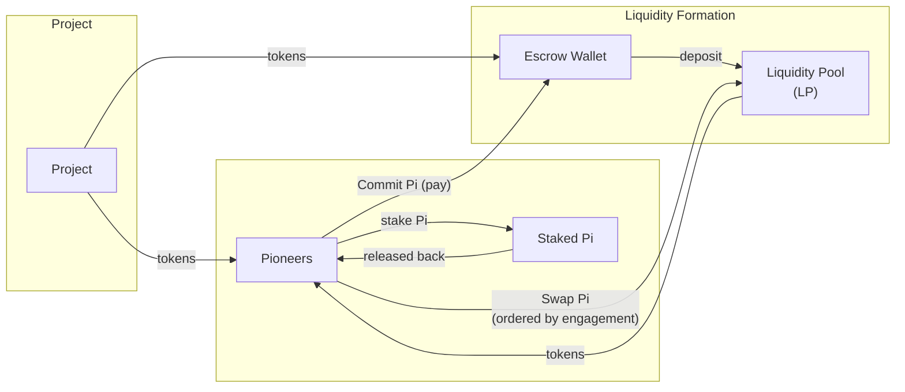
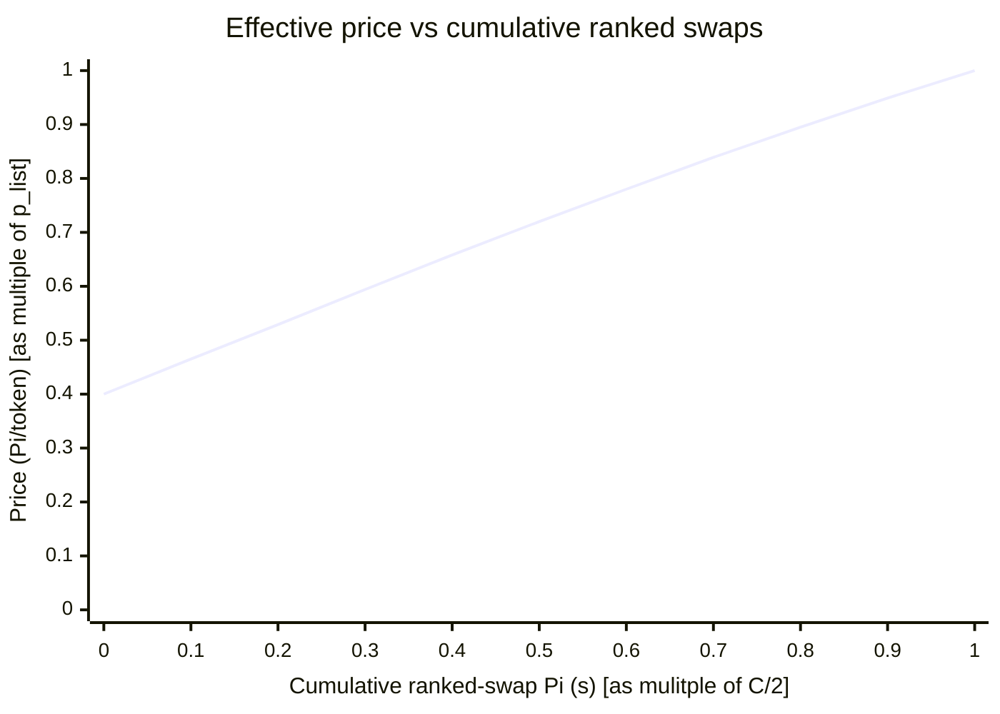

## 4 Allocation Period

This section describes **design option 2**: LP formation that uses both **deposit** and **swap** operations. The high-level token flows are:

### 4.1 Fixed-Price Portion + LP Formation followed by Engagement-Gated Swaps
**Notation:** 
- $T$ = total ecosystem-token amount available through the launchpad for this project (the “launch allocation”) -- NOTE: this includes the portion that will be purchased by Pioneers and the portion that will end up in the Liquidity Pool
- $C$ = total Pi committed by participants to purchase tokens of a project, 
- $p_{list}$ = listing price (Pi per token).

Total amount of tokens T in the the launchpad is divided into 80/20 two portions. 
- 80% of T are deposited to the Liquidity Pool (LP)
- 20% of T is to be sold at the Listing Price which will be calculated by $\frac{C}{0.4T}$

Participants' total committed Pi (C) will be split into 50/50 two halves. 
The first 50% of C is used to deposit in Liquidity Pool in exchange for the 20% at the Listing Price
The second 50% of C is used to swap tokens from the LP in a controlled rollout based on the Engagement Score. 

This is achieved with the following specific steps:

- **Step 1 fixed-price delivery:** Half of the total committed Pi ($C/2$) is transferred to the Escrow Wallet and it directly buys **20%** of the launch token allocation ($0.2T$) and is delivered to participant as a **direct sale at** $p_{list} = \frac{C/2}{0.2T} = \frac{C}{0.4T}$.  

- **Step 2 Escrow deposit and pool creation:** The Pi received by the Escrow Wallet in Step 1 ($C/2$) is paired with the remaining **80% of the launch token allocation** ($0.8T$) and deposited into the LP by the Escrow Wallet.
   - This means the initial spot price of the pool is $p_{init} = \frac{C/2}{0.8T}  = p_{list}/4$
   - And the **constant-product invariant** $k$ of the LP is $k = C/2 \times 0.8T \Leftrightarrow k = 0.4CT$.
   - After depositing these two assets into the LP, the Escrow Wallet account will be permanantly locked by removing its own signing authority to 0 on the blockchain (an irreversible operation). This ensures that no one can withdraw the initial liquidity used to seed the pool. 

- **Step 3 Automated Engagement-Based Swaps:**
   - Engagement Score was measured during the Participation Window; participants are ranked highest-to-lowest based on Engagement Score at Participation Window close.
   - This allows participants to acquire tokens at different effective discounts based on their engagement with the project's app, through the swap functionality of the LP: the participants can get up to 60% discount from listing price depending on their engagemnt with the project's app. Discounted tokens will have a lockup period after TGE. The length of lockups correlates with the size of the discount, e.g. the higher discount someone receives, the longer the period that the tokens acquired at a discounted price will be subject to a lockup. (This does not apply to the portion of the tokens they get at the Listing Price). The math is shown below.
   ---
   - The swaps are execuated based on Engagement Score rank: the highest-engaged users swap first at the initial spot price of the pool ($ p_{init} = p_{list}/4$), getting highest discount; Less-engaged users will swap later at incrementally less discounted prices, up to a maximum price that equals undiscounted the listing price, $p_{last}.
   
   $$ 
   p_{last} = \frac{last Pi In The Pool}{last Tokens In The Pool} = \frac{C}{\frac{k}{C}} =  \frac{C}{\frac{0.4CT}{C}} = \frac{C}{0.4T} = p_{list} 
   $$

   - As half of the committed Pi is in step 1 and half in step 3, the effective acquisition price for the most engaged participant is the harmonic mean of $p_{list}$ and $p_{init}$ (with equal weights), $p_{min} = \frac{2p_{list}p_{init}}{p_{list}+p_{init}} = \frac{2p_{list}(p_{list}/4)}{p_{list}+p_{list}/4} = 0.4p_{list}$, i.e., giving the most engaged person a 60% discount from the Listing Price.
   - Likewise, the effective acquisition price for the least engaged participant is the harmonic mean of $p_{list}$ and $p_{last}$ (with equal weights),  $p_{max} = \frac{2p_{list}p_{last}}{p_{list}+p_{last}} = \frac{2p_{list}p_{list}}{p_{list}+p_{list}} = p_{list}$, i.e. giving the least engaged person no discount at all over the listing price. They purchase the tokens at the listing price at which they committed. 
   - Note: For simipilicity, the calculations ignore LP swapping fees which is 0.3% per swap. 
   
**Automation:**
   - These steps do not require manual actions from participants after the commitment window because swaps are executed automatically with signed consents by the participants at the time of commitment.
   - During the allocation period, LP interaction is strictly limited to these sequenced engagement-based swaps. There is no open access to the LP, ensuring deterministic and fair execution.

#### 4.1.1 Formula of Effective Price Distribution for Launchpad Participants based on Engagement

Define $s$ as the **cumulative Pi swapped into the LP during Step 3** (ranked swaps), with:

$$
s \in [0, C/2]
$$

Let $x$ be the LP’s Pi reserve and $y$ the LP’s token reserve. At the start of Step 3 (right after escrow forms the pool), reserves are:

$$
x_0 = C/2,\;\;\; y_0 = 0.8T,\;\;\; k = x_0y_0 = 0.4CT
$$

After $s$ Pi has been swapped in (ignoring fees), reserves are:

$$
x(s) = C/2 + s,\;\;\; y(s) = \frac{k}{x(s)}
$$

So the **marginal swap spot price** (Pi per token) as a function of cumulative ranked-swap flow is:

$$
p_{swap}(s) = \frac{x(s)}{y(s)} = \frac{x(s)^2}{k}
$$

Substituting $x(s)=C/2+s$ and $k=0.4CT$ into $p_{swap}(s)=\frac{x(s)^2}{k}$, then eliminating $T$ using $p_{list} = \frac{C}{0.4T}$, gives the normalized form:

$$
\frac{p_{swap}(s)}{p_{list}} = \frac{1}{4}\left(1+\frac{2s}{C}\right)^2
$$

which increases smoothly from $\frac{p_{swap}(0)}{p_{list}}=\frac{1}{4}$ up to $\frac{p_{swap}(C/2)}{p_{list}}=1$.

However, each participant’s **effective acquisition price** uses *both* buckets:
- Bucket A (Step 1): $C/2$ at the fixed listing price $p_{list}$
- Bucket B (Step 3): $C/2$ swapped from the LP at the participant’s engagement-ranked swap price 

For a participant who executes at the margin when cumulative swaps equal $s$, the **effective price** (on total committed Pi) is the harmonic mean of $p_{list}$ and $p_{swap}(s)$ (equal weights because it is a 50/50 Pi split):
$$
p_{eff}(s) = \frac{2p_{list}p_{swap}(s)}{p_{list}+p_{swap}(s)}$$

This yields the range mentioned above:

$$
p_{eff}(0)=0.4p_{list}\;\;\;\text{and}\;\;\;p_{eff}(C/2)=p_{list}
$$

#### Diagram: $p_{eff}$ vs cumulative ranked swaps ($0$ to $C/2$)
The chart below plots the **effective price** $p_{eff}(s)$ against the 
**cumulative swap amount** $s$.

Next: [`5-tge-state`](../5-tge-state/5-tge-state%20design%202.md)